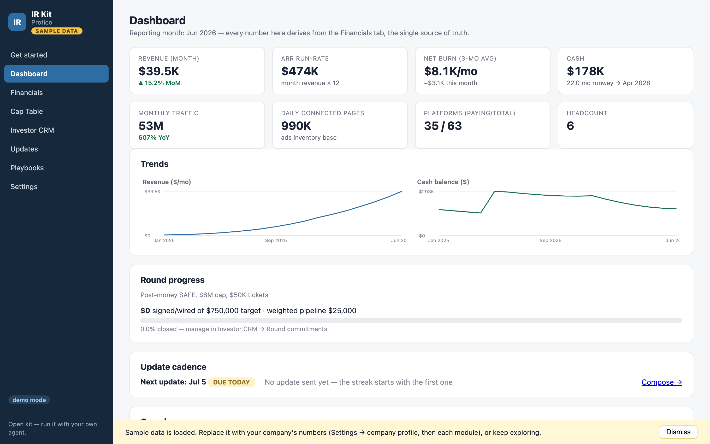

# IR Kit

**Run investor relations like you have an IR team of ten — even if it's just you and an AI agent.**

Most founders learn IR by losing: a diligence that stalls on a messy SAFE stack, an update streak that dies the first bad month, a data room assembled in a panic the week a term sheet shows up. The founders who raise well aren't smarter — they run a *system*. IR Kit is that system, open-sourced: the tools **and** the operating doctrine of an A-class startup's investor relations, runnable by any founder, anywhere, for free.

[](https://howieyoung.github.io/ir-kit/)

<p align="center"><b><a href="https://howieyoung.github.io/ir-kit/">▶ Try the live demo</a></b> — sample company, your edits stay in your browser · <a href="docs/assets/captable.png">see the cap table & SAFE ledger</a></p>

- 📊 **Financial command center** — monthly close, burn/runway/zero-cash date, KPI dashboard, runway scenarios for hiring decisions
- 🧮 **Cap table & SAFE math** — SAFE ledger with implied ownership, a priced-round modeler using real post-money SAFE mechanics, founder dilution walk to Series A, exit waterfall
- 🤝 **Investor CRM** — round commitments with weighted pipeline, interaction log, asks tracker, update distribution segments
- ✉️ **Update composer** — YC-format monthly updates with metrics auto-filled from your financials, plus the archive a future lead will read back-to-back
- 📚 **Playbooks** — update doctrine, batch fundraising process, tiered data-room checklists (interactive), board pack structure, hard-question FAQ frames, diligence-grade metric definitions
- 🤖 **Agent harness** — [prompt sets](prompts/) and a [private workspace scaffold](scripts/init-workspace.js) so your coding agent (Claude Code, Cursor, …) operates the whole system with you

## Quickstart

```bash
git clone https://github.com/howieyoung/ir-kit && cd ir-kit
node server.js                      # Node 18+, zero dependencies — that's the whole install
# → http://127.0.0.1:4820
node scripts/init-workspace.js      # scaffold your private data room / board / CRM folders
```

Explore with the built-in sample company, then replace it with yours (Settings → profile, or hand your agent `prompts/monthly-close.md`).

## Learn it in 10 minutes

**[→ The tutorial](docs/TUTORIAL.md)** — also built into the app as the **Get started** page:

- **Use it yourself** — the first-30-minutes walkthrough and the monthly rhythm
- **Use it with your agent** — setup, the prompt rituals, and putting your agent on a schedule so the update draft is waiting for you on update day
- **Cap table 101** — never seen a SAFE? Ten minutes to using the modeler confidently
- **Glossary** — every term in the kit, one line each

The kit also tracks your cadence: the dashboard shows when the next update is due (and your streak), and Updates → Schedule exports a recurring calendar file for update day + quarterly board packs.

## Your data stays yours — by architecture

This is the part that matters, so it's not a policy, it's the design:

| | Where your data lives | What the public sees |
|---|---|---|
| **Self-hosted (default)** | Plain JSON in `data/` + files in `ir-workspace/` — both **gitignored**, both local | Nothing |
| **Static demo hosting** | Each visitor's browser localStorage only | The fictional sample company |

- The repo ships **only a fictional sample company** ("Protico" is used as the sample brand; every number, investor, and contact is invented).
- `data/` and `ir-workspace/` are gitignored, so a fork can't accidentally publish a cap table.
- The server binds to `127.0.0.1` by default and has no accounts to breach — there's nothing to sign up for and no one else's infrastructure holding your SAFEs.
- Back up by making `data/` + `ir-workspace/` a separate **private** repo, or export everything as one JSON from Settings.

## Operate it with your agent

The kit is deliberately agent-native: all state is human-readable JSON ([schemas in CLAUDE.md](CLAUDE.md)), all logic is dependency-free vanilla JS, and [`prompts/`](prompts/) contains the recurring rituals as ready-to-paste prompts:

- **Monthly close** → agent updates financials, computes burn/runway, flags misses against last month's promises
- **SAFE signed** → agent reconciles cap table + CRM + distribution list in one pass and checks your dilution guardrail
- **Draft update** → agent writes the YC-format update from real numbers only, keeping metric continuity with the archive
- **Meeting prep / data-room audit / round kickoff** → one-page briefs, punch lists, and round plans into your private workspace

That's the "IR team of ten": the system remembers the cadence, the agent does the clerical work, you make the calls.

## Deploying

- **For yourself:** it's a local app; you're done. On a server (Fly/Railway/VPS/Docker): `HOST=0.0.0.0 node server.js` — ⚠️ **no built-in auth**; put it behind Cloudflare Access/Tailscale/basic auth. Your cap table is on this thing.
- **Public demo for others:** host `public/` on any static host (this repo auto-deploys it to GitHub Pages). No server → demo mode → visitors' edits stay in their own browsers.

## What this is not

Not legal advice (conversion math is a planning tool; counsel and the instruments decide), not a Carta/Pulley replacement (no 409A, no share issuance — export to those when you price a round), and deliberately **not a multi-tenant SaaS** — hosting strangers' cap tables is an auth/encryption/compliance product; this kit's answer is that nobody should have to upload their cap table to use good IR tooling.

## Contributing / roadmap

Small, dependency-free PRs welcome. Wanted next: configurable traction-metric columns (currently sample-company-shaped: traffic/pages/platforms), CSV import for financials, opt-in scheduled sending via bring-your-own SMTP, priced-round (non-SAFE) ledger entries, more playbooks (debt, bridge, secondaries), localization. Keep the promises: zero deps, no build step, local-first, agent-editable JSON. See [SECURITY.md](SECURITY.md) for the security model.

MIT © [Howie Young](https://github.com/howieyoung)
